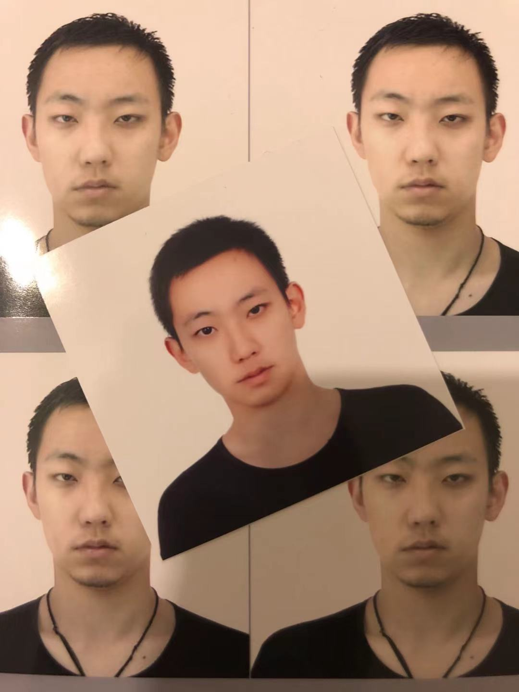

# 江鹏飞，JIANG, PENGFEI
pengfei.jiang2018@gmail.com

{: width="200"}

### About Me
Hi guys. I'm a 26-year old millimeter-wave radar algorithm engineer at [Calterah Semiconductor](https://www.calterah.com). My job mainly combines digital signal processing, data analysis/feature extraction, as well as application layer programming on a high level. I'm also interested in neat coding as well as project management skills, which is exactly what I lack of.

I love board games (e.g. [terra mystica tornament](https://tmtour.org)), finger style guitar, swimming and improv. Not that I'm good at any of them.

I've been diagonized of Iga nephropathy for 10 years and glaucoma for 7 years. I'm sharing informations I've collected over time regarding this two deseases to reassure people who suffer the same. As you could see I'm doing just fine, so could you.

### About This Website
It is currently maintained as a markdown based static repository of my notes on tech/entertaining readings, daily life, etc. Hope you enjoy it.

[Reading and reviews](./reading/index.md)  
[Theatre](./theatre/index.md)  
[Iga Nephropathy](./igan/igan.md)  
[(Temp)Calterah open day](./openday/index.md)  
