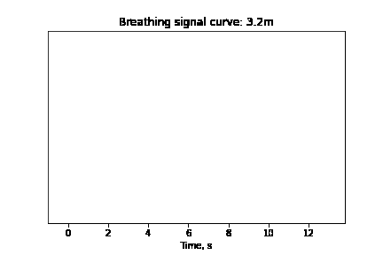
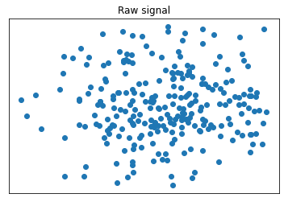

## Work for Fun @ Calterah Semiconductor

`pengfei.jiang@calterah.com`

* A recent project: human vital signal with mmwave radar

    * to get this:



{: width="500"}

    * from this:

{: width="500"}

* And more:

    * Theoretical deduction and validation
    * Signal processing/data analysis
    * Minimized memory consumption
    * Neat coding: transparency, easy maintainence, clear documentation

[pre](./pg0.md)

[next](./pg2.md)
