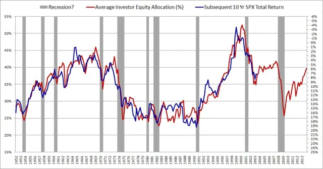

# 碎片记录

记录一下在公众号/雪球上读到的有意思的内容.

## [@配置喵](xueqiu.com/u/4698846123)

**2022-07-10**

### AIAE

最初关注到这个账号, 是发现他21年8月8日摘录翻译了一篇雄文: ['Average Investment Equity Allocation (AIAE)'](http://www.philosophicaleconomics.com/2013/12/the-single-greatest-predictor-of-future-stock-market-returns/). 原作者使用1952年以来某一时刻的权益资产/金融资产(权益+债券+现金)的比值, 与此后十年的标普指数回归拟合, 得到了非常高的相关性. 作者对此的解释是: 抛开一切投资标的的具体属性, 作为整体的金融市场投资者只能在权益资产和固收资产(债券/现金)中做分配. 这种分配整体上可以认为是被动的, 受到股票市场整体的价格变动和货币市场的供给的影响. 而这两种影响通过AIAE归一化: 股市的过热过冷和货币的宽松收紧, 都体现为金融市场中, 权益资产总市值占比的变化; 分配比例的修复机制则决定了权益资产的价格变化, 从而决定权益市场的综合回报率.

{: width="400"}

这个思路非常迷人. 大概是五六年前我有过这样一个疑问: 权益资产和计价资产在数学上是截然不同的. 在后者的模型中只有利率和久期这寥寥数个变量, 实在容纳不下现实中千变万化的复杂度. 很长一段时间内, 我认为债券市场是不太可能存在充分定价的. 按照这篇文章的思路, 不需要债券市场的局部均衡, 只需要权益市场和债券市场的一般均衡即可. 另外, 这个模型甚至横跨了金汇兑本位的19年和信用本位的50年, 而在两段历史中取得了相仿的成绩, 不禁令人想, 这种金融资本的平衡机制, 是不是拥有比'投资者资产配置'更本质的内在动力? 它是不是与经济活动对资本的需求结构有关? 随着经济活动本身的变化, 这种需求结构是否会变化, 从而表现为'均衡配置'及其修复机制和修复周期的变化, 以及AIAE-SPX相关性在很长一段时间内的漂移.

(1975年之后的接近十五年时间, AIAE都处在28%左右的低位, 对应于长时间内的超高回报率)

文章中提到的数据并不难获取, 可以尝试用其他周期来验证相关性, 但是一直没有动手.

### 对巴菲特的分析

[别想了, 你学不会巴菲特](https://xueqiu.com/4698841123/223627993)

这是一篇22年6月发布的原文的主要观点整理一下是: 从量化归因的角度, 巴菲特三分之二的alpha来自廉价杠杆, 另外三分之一来自系统性做多垄断资产, 压注美国永远经济良好, 温和通胀. 在09年以后, 这两个优势消失时, 巴菲特的表现并不好, 而22年加息和通胀回归, 巴菲特的超额收益再现. 按照上述分析, 巴菲特的成绩与价值投资理念关系并不强, 在今天的环境下学习巴菲特的价值投资理念难以构建超额收益(但不可否认价值投资理念可以提供收益, 至少规避不必要的风险).

在本文下的一个回复中, 原博说: "巴菲特除了巴菲特指标(总市值/GDP)之外, 几乎没有留下任何可以量化的信息, 巴菲特所有理论, 都是千人前面的." 我觉得这是一个非常有力的论述. 如果投资的结果可以归因与知识, 而非运气或其他禀赋(例如廉价杠杆"), 那么这种知识应当, 也必须, 要用更精确的方法表述, 从而确保其'可服用性'. 遗憾的是, 其他人的回复中, 并没有太多对这一挑战的正面回应.

我大概是14年开始了解金融市场投资时就接触了价值投资理念, 上学时拿一点小钱折腾, 到今天靠着这套基本的理念没有踩过什么大坑, 但这段时间同样没有什么超额收益. 更重要的是缺少复盘和检讨的习惯及方法; 遇到波动时体验糟糕, 赶上盈利得不到积累, 抄作业抄不全, 总而言之, 基础理念之外全凭本能. 故而有了这里记录碎片阅读的想法.

## [王国斌]

**2022-07-31**

雪球创始人方三文的访谈节目首期嘉宾, 二十八年从业经历的资管老将. 有些内容觉得是老生畅谈的: 资金的目标决定了资管的方式, 合理的风险和汇报期望, 选择以长期收益为目标的资金; 有些觉得不明所以的, 叙事, 噪声, 博弈, 催化剂. 印象中逻辑链条长一些的内容, 有一段讲, 快速的技术迭代和研发投入只能惠及消费者, 长周期的产品才能回报股东; 一段讲, 生物医药的研发, 结果是非零即一的, 不存在中间状态, 大企业才能用更大的产品线来平滑资本收益.

短期内不太可能再回去看一遍应该是不太可能了. 以此为引子, 记录一些其他人的观点和讨论.

大药企才能生存的这一段和张小丰持有的观点是有一些差异的. (张小丰是一个生物医药统计学背景的投资经理, 对生物医药行业有大量论述; 他还是准职业级别的星际玩家和业余吉他手, 最初的账号取自著名吉他手Steve Vai; 除了投资, 时不时聊一些个人消费, 聊牛排, 聊大屏彩电, 聊AMD的chiplets架构如何在性价比上吊打intel, 聊什么时候装机最划算, "认真理性地享受生活". 总的来说, 信息量非常高, 是我一直以来最喜欢的雪球账号之一. 后面有机会专门记录一下他的讨论内容, 以及2022年初美股生科大熊市期间他的发言等).

关于创新药, 张小丰的基本观点是: 医药创新的需求长期存在, 而领域和方法千奇百怪, 大公司(biopharmacy)常常并不能凭借体量优势提升研发层面的供给能力或效率, 更多地是购买小型研发公司(biotech)的产品, 凭借已经建立起来的成熟销售网络实现销量快速爬坡, 凭借组合临床等方式拓展药品适应症来最大化地开发药品价值等. 另一方面, 随着专利保护期的倒计时, 大药企的巨额销售必然意味着未来的断崖式下滑, 维护销售额, 维护企业已经建立起的组织架构, 就必然要求大药企通过合作或买断等方式维护自己的商业规模. 因而小企业做技术研发, 大企业做商业开发是这个行业的基本格局; 具体到个别公司, 或许小企业回报的方差更大; 但总体而言, 并不存在大企业相对小企业拥有长期系统性优势.

说回王国斌的访谈. 还谈到做一些统计分析, 谈他赚得最多的钱是企业自由现金流增长而非估值提升, 谈12/13年判断不符合绿色化工方向的企业没有前景. 最后一条, 恰好碰上我上周读\<政治的逻辑\>时参考第三个历史决议, 看到富强民主文明和谐之外, 强调五位一体的最后一位, 生态文明建设, 而有些感触.

配置喵和cfuwxd给出的评价非常高. 前者说"区分一个合格投资者的分水岭就在于能否理解王国斌在说什么. 叙事, 噪音, 催化剂, 运气, 内源, 外源, 全是关键词". 他的终极结论是"王的这些内容, 很大一部分来自于Druckenmiller, 真正经历市场历练的悍将". 配置喵也一直是一个信息量非常足的账号, 此前已有不少记录. 他在谈王访谈中提到的一句"量化可以提供洞察力"时讲, 量化分析已经确定了A股周四定投效果最好, 逻辑分析则猜想T+1交易制度可能导致了这个结果. 不管听没听懂, 作业可以抄起来.

cfuwxd(吴晓东)同样给出了很高的评价, 例如:

* 噪声是相对信号而言的, 可以理解为完全无规律的随机波动; 叙事, 是一种对于历史的或未来的某某过程的某个视角的解读. 叙事问题, 除了自身的自洽性或不可证伪性外, 还指具有传播性, 反身性, 偶然性...叙事不能简单理解为"故事"或者"逻辑", 其实这个词是用的很准确, 就是字面意思, 比幸运和能干的表述更加准确
* 投资理念本质是哲学问题, 你怎么看这个世界, 你相信什么, 映射到投资上就是投资理念. "投资是一个竞争性的活动, 只在有优势的地方进行竞争", 这本来就是非常简单清晰有效的理念...

最有趣的地方, 或许是cfuwxd在多处发言中表达了"你们理解不了", "99.99%的人都理解不了"等. 这种言辞形式上颇类似于江湖骗子自抬身份. 不过我还是倾向于认为, 这是一种强烈的表达欲望和有限的表述意愿的的矛盾的表现. 表达一个观点很容易, 而表述清楚相当困难, 尤其是当由于各种因素的限制, 必须脱离自身惯常的思考范式的时候. (自己近期写专利交底书, 最初就十分不适应用非工作语言解释技术问题). 吴晓东著有一本价值投资从入门到精通, 一些推演具体行业整体趋势的文章也不都那么难.

(注, 看访谈比看演讲难好多, 麻烦好多.)

## [李想]

**2022-08-07**
