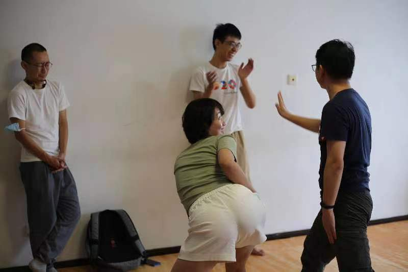

# 0904排练记录·沫含带领的

`pengfei.jiang@calterah.com`

记录的初衷是写给未来的自己看, 所以会比较多提到自己的部分, 也比较主观, 请见谅; 也会逐渐收录同伴的记录.

## 热身

拉伸是我带的!

我印象中这还是第一次对排练做出主动的贡献. 一直都能感受到同伴们对排练的付出: 安排内容, 联系场地, 领航员和乐师被长期固定在自己的位置上, 等等. 辛苦了.

再推荐一下素材来源[梦觉教游泳](https://www.bilibili.com/video/BV1bx411L7sA?p=5), 讲得十分扎实而且可以当相声听. 广普口音的"诶我就问你们在陆地上的时候眼睛不看自己的手知不知道它伸没伸直? 这个是所有人都知道的." 有种梦回小学校园的感觉.

## 即兴

洗牛奶这个游戏很能调动注意力和兴奋度; 后来的两个环节, 三句话和叙事演绎, 都有练到"清晰地传达自己的意图"这一点. 比起一人一句台词的即兴喜剧, 自由演绎的交互节奏并没有那么快, 对于三句话交代人物事件环境的戏剧要求也没有那么高, 但是向队友表明自己的意图仍然是十分重要的.

(我个人感觉, 即兴虽然很能让人兴奋起来, 但这种兴奋过后的疲惫也很强; 而且我兴奋起来后会有种更独断自以为是的倾向, 所以在这个环节的参与度不太高, 抱歉)

叙事演绎还覆盖了编导能力. 我印象中, 平时的团练里, 大家都很能发现"这里需要新的变化和推动", 但是往哪个方向变, 需要很丰富的想象力. 我们这次团练中有好几次提到了时间的切换, 在对讨债故事的复盘, 和后来核心环节对天羽故事的表现中都有. 另外周巍编的故事中就有非常好的情节推动.

也许有的时候, 新的主题是从当前的场景中自然发生的. 即便没有重大的变化, 也可以舒适地维持当前的场域, 仿佛飘在水面上等待下一个浪尖到来. 这种自然的续航, 耐心, 是我在还原剧团的演出中经常看到的能力.

这一点上我做得确实不太好. 在后来对嘉玉的故事的演绎中, 我给了一个明确的开头, 但是没等到队友充分加入就提前撂挑子了. 回想起以往的几次团练, 我似乎每次都有跪倒跌倒趴倒之类的"I'm out"动作, 应该可以改善.

总的来说, 一方面可以对"编导"的需求和方向有原则性的认识和把握, 另一方面信任自己和队友, 保持敏锐的感官, 让推动自然地发生.

## 核心

先从第二段讲起, 嘉玉讲了一个撕裂的故事, 该职业还是该本色. 我认为我听到的核心是"她对于不同的人的认可成都不同, 在没那么认可的人面前, 根本不愿意把真实的一面展露出来". 这个判断其实结合了我自己的生活体验. 这与演员所要求的"容器"状态矛盾吗?.

即便这个判断是某种程度上准确的, 又应该怎么回应它呢? 是把这个理解直接呈现出来呢, 还是再做进一步的延伸? 亦或者只是把它埋在原本的情节中做一个暗示和背景?

即便每个故事都有自己的what/how/why, 或许我们也可以有选择地应对. 比如这个故事中, 也许嘉玉的how (矛盾, 困惑)比潜在的why更适合作为呈现的重点? 后面嘉玉和吟安关于后者故事的讨论, 也可能有类似的导向: 尽管我没有听到这个故事, 但吟安的讲述中似乎更重视现在问题已经解决了, 是以轻松愉快的方式去回顾曾经的问题和挑战.

天羽的故事也给我类似的感受. 我没法在不提及故事内容本身的情况下, 把我勉强总结的核心讲清楚; 如果再稍微关注一下她讲故事的方式, 会有更多的灵感来源. 稻子和鸭子的意象都是老狼提供的, 前者指向"背负", 后者指向某种"不对等", 已经非常好地表达了我所总结到的"核心".

(关于编创, 我还是稍微有点不适应, 感觉发生两次不如只发生一次)

## Contributed by 嘉玉

我的记录: 感谢大家今天对我故事的回应，我自己觉得是很难演的，但我想要讲出来的冲动太强烈了。在回味这个被认真回应的过程（每个人都要讲出自己认为的核心以及表演的考虑）我好像也找到了自己的答案。两张牌是我为自己找到的简便解，它保护了我，在这里休养生息一些时间以后也许我可以去挑战更为弹性的布局。

- "我突然想到吟安的故事是不是只要演舒展和欣喜的部分就可以了，虽然前面还有一些前情提要，但重点是后面的，就是在转译的时候加多一个剪裁的意识"

## Contributed by 老狼

记录：今天第一次参加，很开心呀认识了这么有趣的大家，玩儿了没玩过的游戏，互相分享的心情和故事，还恰了好吃的，虽然我果然又加餐了(非unicode字符:嘿哈)

## Contributed by 吟安

9/4排练记录：
我看到带领人在今天做了很多准备，也有现场流动的发生，被充分重视和允许，感到很满足～
过程中有一个期待（好像也不只是今天的也包含之前的），期待对每个活动环节可以更清晰，我自己多少在现场会有一点模糊的感觉。这个清晰现在看见的会关于环节的“意图”和“规则”的更清晰。这和我接触戏剧到时间不长或许有关。
今天有一个重要的看见，关于一人一故事的核心。过去听到核心两字，我更多的会纯粹地去看本质（可能和督导过程混了），今天我发现其实这里核心是关乎于对讲者的意义，这开始和我熟悉的地方连起来了，感觉拼上了一小块地图～

- "嗯～这和我当下的状态比较接近，我觉得也许也可以反向操作，倒叙。"

{: width="200"}
